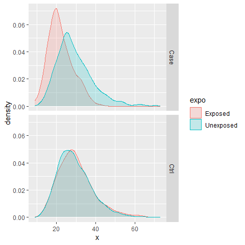
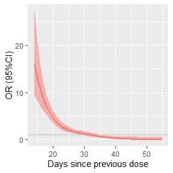

# vadim

Code and simulated data for the manuscript **Influence of mRNA Covid-19 vaccine dosing interval on the risk of myocarditis** by Le Vu et al.


```r
knitr::read_chunk("functions.R")
```


```r
{
  library(survival)
  library(rms)
  library(ggplot2)
}
```


```r
parms <- list(ncase = 1000, kctl = 5,
              pn = 0.1, or = 2,
              mean_x_exp = 21,
              mean_x_unexp = 28)
outlb <-  c(0.01, .99)
```

- We are analyzing a matched case-control study with essentially two covariates, first $V$ the recent exposure to a vaccine dose (binary variable), and $X$ a continuous time interval that represents spacing between previous and current dose.
    - While the recent exposure is a risk factor in itself, we state that the time interval only acts as a risk factor conditional on recent exposure.
    - The hypothesis for the research question is that shorter spacing between doses increase the risk of being a case in people recently vaccinated (i.e. exposed).
    - We will quantify the relation by either categorizing $X$ or modelling it continuously.
 
## Data   
- We start by simulating data from a matched case-control study. Parameters are set so that
    - Study comprises 1000 cases and 5 controls per case.
    - Proportion $p_n$ of exposed among controls is 10%.
    - True odds-ratio of being exposed is 2, so that $P(exposed|case) = OR \times p_n =$ 20%.
    - Exposed cases have a shorter spacing between doses relative to controls and unexposed cases (21 vs 28 days).
    

```r
## simulate dataset with known risk factors.
# 1:k controls, binary exposure,
# continuous variable (delay) that depends on binary exposure (in cases)
# so that exposed cases tend to have shorter delays
make_mcc <- function(
    ncase = 10,
    kctl = 2, ## nb of ctl per case
    mean_x_exp = 21, ## mean delay for exposed case
    sd_x_exp = 0.3, ## sd of log
    sd_x_unexp = 0.3,
    mean_x_unexp = 28, ## mean delay for unexposed case and ctls
    pn = .1, ## baseline prob of binary exposure (among ctl)
    or = 2, ## OR of binary exposure ( P(exp|case) = or * pn )
    seed = 321
){
  ## generate vectors
  set.seed(seed)
  set <- y <-  b <- x <- numeric(0) ## initialize
  for (s in 1:ncase){ ## each stratum
    # case and ctl are exposed to b or not
    b_case <- rbinom(1, 1, or * pn)
    b_ctl <- rbinom(kctl, 1, pn)
    # continuous value for case and ctl
    x_case <- ifelse(b_case,
                     rlnorm(1, log(mean_x_exp), sd_x_exp ),
                     rlnorm(1, log(mean_x_unexp), sd_x_unexp ))
    x_ctl <- rlnorm(kctl, log(mean_x_unexp), sd_x_unexp )
    ## append values
    y <- c(y, 1, rep(0, kctl))
    set <- c(set, rep(s, 1 + kctl))
    b <- c(b, b_case, b_ctl)
    x <- c(x, round(x_case), round(x_ctl))
  }
  ## data frame
  df <- data.frame(set, y, b, x)
  df
}
```


```r
# df <- make_mcc(ncase = 1000, kctl = 5)
df <- do.call(make_mcc, parms)
```


```r
if (TRUE){
  head(df, 10)
  # raw OR
  m <- table(case = df$y, exposed = df$b)
  m <- matrix( as.numeric(m), ncol = ncol(m), dimnames = dimnames(m))
  or <- m[1,1] * m[2,2] / m[2,1] / m[1,2]
  ## plot
  df$cc <- ifelse(df$y == 1,'Case','Ctrl')
  df$expo <- ifelse(df$b == 1,'Exposed','Unexposed')
  p0 <- ggplot(data = df, aes(x, colour = expo, fill = expo)) +
    geom_density(alpha = .2) +
    facet_grid(vars(cc))
}
```
- We can look at the contingency table (control/case by unexposed/exposed)

```r
m
```

```
##     exposed
## case    0   1
##    0 4500 500
##    1  801 199
```
- Raw OR is 2.24
- And the delay distribution is shifted for exposed cases

```r
p0
```

<!-- -->

- Model parameterization is either
   - One categorical variable of exposure $E$ that combines $V$ and quantiles of $X$: "Unexposed", "Exposed and 1st quantile of x", "Exposed and 2nd... etc". So that $E$ has (1 + $k$ quantiles) categories.
   $$logitP(Y=1) \sim \beta_0 + \beta_1 E$$
   - One binary variable of exposure + one continuous variable for spacing + interaction term. Or $$logitP(Y=1) \sim \beta_0 + \beta_1 V + \beta_2 X + \beta_3 (V \times X)$$

## Categorized $X$

```r
{
  q <- quantile(df$x, probs = outlb)
  x <- ifelse(df$x %in% q[1]:q[2], df$x, NA)
  # categorize x
  nqt <- 5
  co <- quantile(x, probs = seq(0, 1, 1/nqt), na.rm = TRUE)
  df$xc <- cut(x, co, right = FALSE)
  # new expo variable
  df$expo <- factor(ifelse(df$b == 1,
                 paste0("E_", df$xc),
                 "UNEXP"),
                 levels = c("UNEXP", paste0("E_", levels(df$xc))) )
  ## Fit clogit on categories
  {
    m <- clogit(y ~ expo + strata(set), data = df)
    res <- as.data.frame(
      round( cbind(exp(coef(m)), exp(confint(m))), 2) )
    colnames(res) <- c("OR", "OR_lo", "OR_up")
  }

}
```
- odds ratio by category

```r
res
```

```
##                 OR OR_lo OR_up
## expoE_[14,22) 6.58  4.85  8.93
## expoE_[22,26) 2.75  1.85  4.09
## expoE_[26,30) 1.28  0.82  1.99
## expoE_[30,36) 1.12  0.70  1.79
## expoE_[36,55) 0.27  0.11  0.66
```
## Continuous $X$
- partial-effect plot 

```r
{
  # Fit conditional logistic regression with RCS and an interaction
  dd <- datadist(df)
  options(datadist='dd')
  sfit <- lrm(y ~ rcs(x, 4) * b, data = df, x = TRUE, y = TRUE)


  ## explicit prediction
  {
    bound <- quantile(df$x, probs = outlb) ## rm 1% extreme
    xref <- parms$mean_x_unexp
    xs <- bound[1]:bound[2]
    a <- list(x = xs, b = 1)
    b <- list(x = xref, b = 0)
    con <- contrast(sfit, a, b)
    df1 <- data.frame(x = xs, lapply(con[c('Contrast','Lower','Upper')], exp), 1 )
    names(df1) <- c("x", "or", "or_lo", "or_up", "group")
  }


  ## plot
  p2 <- ggplot(df1, aes(x, or)) +
    geom_ribbon(aes(ymin = or_lo, ymax = or_up,
                    fill = "red"), alpha = 0.5)  +
    geom_hline(yintercept = 1, col = "grey") +
    geom_line(aes(colour = "red"), linewidth = 1) +
    # xlim( li[[1]] ) +
    xlab("Days since previous dose") +
    ylab("OR (95%CI)") +
    theme(legend.position = "none")
  p2
}
```

<!-- -->

